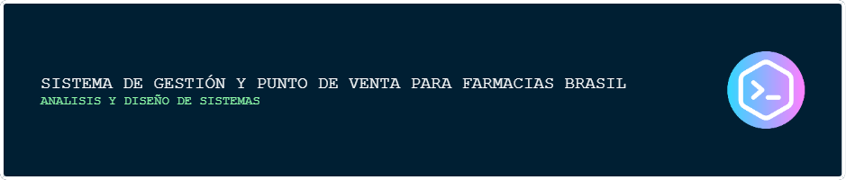
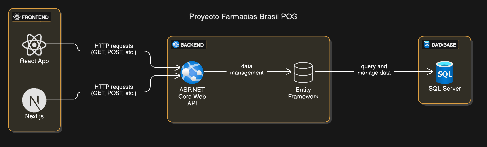

[](https://deepwiki.com/jonatanegcPM/proyectInvetoryDSI)


## 📂 Estructura del Proyecto
El proyecto está organizado en las siguientes carpetas:

- **`UX-UI/`**: Recursos de diseño, prototipos y documentación de la interfaz de usuario.
- **`architecture/`**: Diagramas y documentación técnica de la arquitectura del sistema.
- **`backend/`**: Código fuente de la API en ASP.NET Core.
- **`database/`**: Scripts SQL.
- **`docs/`**: Documentación general y archivos adicionales (como imágenes del README).
- **`frontend/`**: Aplicación web desarrollada con Next.js y React.

> [!NOTE]
> Por favor, consulte la documentación oficial del repositorio para obtener una comprensión completa de la arquitectura, estructura, objetivos y directrices del proyecto. Acceda a la documentación aquí: [DOCUMENTACIÓN - SISTEMA DE GESTIÓN FARMACIAS BRASIL](https://deepwiki.com/jonatanegcPM/proyectInvetoryDSI/1-overview)


## ⚙️ Requisitos Previos 

Antes de ejecutar el proyecto, asegúrate de tener instalado lo siguiente en tu sistema:

#### Requisitos generales:
- **Git** (para clonar el repositorio) → [Descargar Git](https://git-scm.com/)
- **Un editor de código** (recomendado: [Visual Studio Code](https://code.visualstudio.com/))

####  Backend (ASP.NET Core)
- **.NET SDK 7.0 o superior** → [Descargar .NET SDK](https://dotnet.microsoft.com/en-us/download/dotnet)
- **SQL Server** (para la base de datos) → [Descargar SQL Server](https://www.microsoft.com/en-us/sql-server/sql-server-downloads)

#### Frontend (React + Next.js)
- **Node.js 18 LTS o superior** → [Descargar Node.js](https://nodejs.org/es)

## 📥 Instalación Inicial
1. Clona el repositorio:
   
   ```bash
   git clone https://github.com/jonatanegcPM/proyectInvetoryDSI.git
   ```
2. Navega al directorio:
   
   ```bash
   cd proyectInvetoryDSI
   ```


## 🚀 Configuración del Proyecto

Este proyecto consta de dos partes: **backend** (ASP.NET Core Web API) y **frontend** (React con Next.js). A continuación, se detallan los comandos para ejecutar, reconstruir y limpiar cada parte del proyecto.

### 🔧 Backend (ASP.NET Core)

Para administrar el backend, usa los siguientes comandos:

1. Navega a la carpeta del backend:

```bash
cd backend
```

2. Restaura las dependencias:  

```bash
dotnet restore
```

3. Configura la base de datos en appsettings.json:

```json
"ConnectionStrings": {
    "DefaultConnection": "Server=localhost;Database=FarmaciasBrasil;Trusted_Connection=True;TrustServerCertificate=True;"
  }
```
4. Aplica las migraciones:

```bash
dotnet ef database update
```

5. Ejecuta el servidor:

```bash
dotnet run
```

### 🎨 Frontend (React + Next)

Para administrar el frontend, usa los siguientes comandos:

1. Navega a la carpeta del frontend:

```bash
cd frontend
```

2. Instala las dependencias:

```bash
npm install --legacy-peer-deps
```

3. Ejecutar el entorno de desarrollo:

```bash
npm run dev
```
4. Construir el proyecto para producción:

```bash
npm run build
```
5. Iniciar el servidor en modo producción:

```bash
npm start
```

## Arquitectura del Proyecto




## Reglas de Colaboración en el Repositorio

Este repositorio sigue un flujo de trabajo organizado para asegurar un desarrollo eficiente. A continuación se detallan las reglas para trabajar con las ramas principales: `main` y `DevOps`, y el flujo de trabajo a seguir.

### Ramas Principales

1. **`main`**:
   - Esta es la **rama de producción**.
   - Siempre debe estar en un estado funcional y libre de errores.
   - Los cambios directos en `main` están **prohibidos**. Los cambios deben ser primero integrados en la rama `DevOps` y luego fusionados con `main` a través de un proceso controlado.
   - Los despliegues a producción se realizan directamente desde `main`.

2. **`DevOps`**:
   - Esta rama se utiliza como **pre-producción**. En ella se concentran los cambios de código, nuevas características y correcciones antes de ser fusionados a `main`.
   - Las ramas de desarrollo deben fusionarse a `DevOps` para su revisión y pruebas antes de hacer el merge final a `main`.


### Flujo de Trabajo

#### **Creación de Ramas de Desarrollo**

- **Ramas de características (Feature Branches)**:
   
   Antes de comenzar a trabajar en una nueva funcionalidad, crea una rama a partir de `DevOps`.
   El nombre de la rama debe ser claro y descriptivo, por ejemplo:

     ```
     feature/nueva-funcionalidad
     ```
   Desarrolla tus cambios y realiza commits frecuentemente en tu rama local.

- **Ramas de corrección de errores (Bugfix Branches)**:
   
   Si encuentras un error en el código, crea una rama desde `DevOps` con el siguiente formato:
     ```
     bugfix/correccion-error
     ```

#### **Fusionar Cambios a `DevOps`**

- Una vez que hayas terminado de desarrollar la funcionalidad o corregir el error, fusiona tu rama temporal a `DevOps` mediante un **Pull Request (PR)**.
- **PR a `DevOps`**: Antes de hacer el merge, asegúrate de que el código haya sido revisado.
  - **Revisión de código**: El PR debe ser revisado y aprobado por al menos un miembro del equipo antes de fusionarse.
  - **Pruebas en DevOps**: Se recomienda realizar pruebas en `DevOps` antes de fusionar a `main`.

#### **Fusión de `DevOps` a `main`**

- Una vez que los cambios en `DevOps` estén listos para producción y se haya verificado que todo funciona correctamente, se procederá a fusionar `DevOps` a `main`.


#### **Eliminación de Ramas Temporales**

- Después de fusionar tu rama temporal (feature o bugfix) a `DevOps`, **puedes eliminarla** si ya no la necesitas. Esto mantiene el repositorio limpio y organizado.


## Autores

- [Jonatan Elías Guevara](https://github.com/jonatanegcPM)
- [Keyri Daniela Chávez](https://github.com/Keiryhernandez)
- [Rodrigo Alexander Mejía](https://github.com/rodri1003)
- [Adonys de Jesús Amaya](https://github.com/adonysdiaz)
- [José Carlos López](https://github.com/Jos3C190)

## Licencia

[MIT](https://choosealicense.com/licenses/mit/)